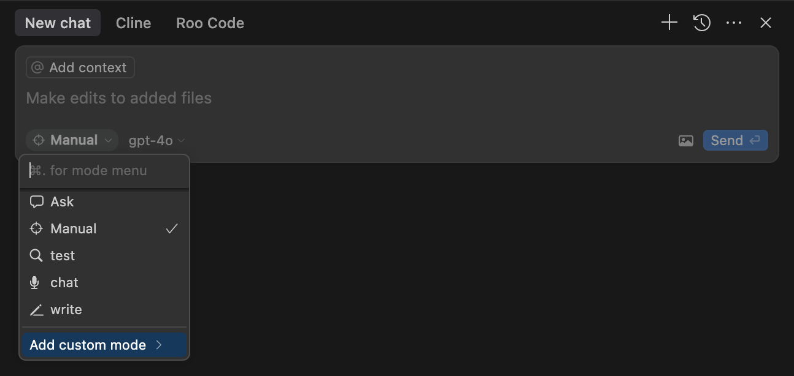
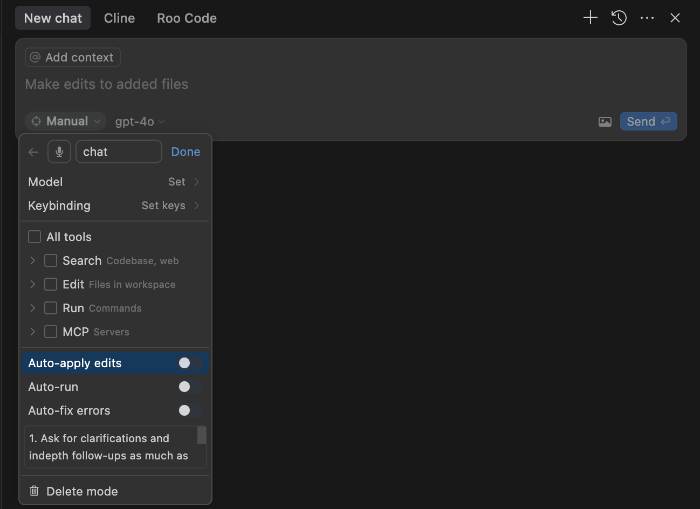
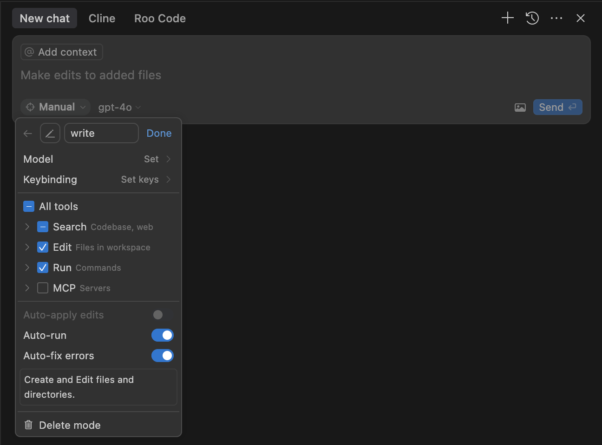
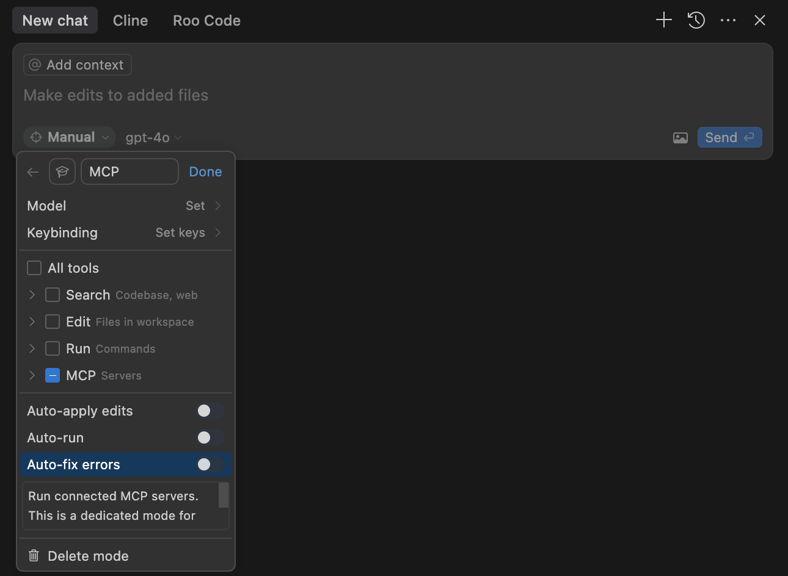

# Template for new projects written in Cursor

## BASIC SETUP
This template provides a starting point for AI-assisted coding projects. 

To get started quickly, place the `.cursor/rules/` directory into your project root.

## Directory Structure
Create this directory structure for the project:

1. **`docs/`**

    ├── **`architecture_docs.md`**

    └── **`product_requirement_docs.md`**

2. **`tasks/`**

    ├── **`active_context.md`**

    └── **`tasks_plan.md`**
3. **`src/`**
4. **`test/`**
5. **`utils/`**
6. **`config/`**
7. **`data/`**

• <code>.cursor/rules/</code> – Custom rules for Cursor  
• <code>docs/</code> – Project documentation, architecture, and reference materials  
• <code>tasks/</code> – Task plans, active context, and general to-do items  
• <code>src/</code> – Main source code  
• <code>test/</code> – Testing suite  
• <code>utils/</code> – Utility scripts or libraries  
• <code>config/</code> – Configuration files  
• <code>data/</code> – Data resources  
• (and potentially more directories as the project grows)

## Rule Files and Key Concepts

This template is organized around a set of rule files and documentation that work together to guide the AI.

### 1. Core Rule Files (`.cursor/rules/`)
These files define the AI's behavior and workflows.

*   **`plan.mdc`**: Defines a workflow for planning and architecture based on understanding requirements, formulating an optimal solution, and seeking user validation.
*   **`implement.mdc`**: Provides a systematic protocol for writing code, including dependency analysis, planning, and iterative changes with testing.
*   **`debug.mdc`**: Outlines a process for diagnosing and fixing persistent errors by gathering context, reasoning about causes, and verifying fixes.
*   **`memory.mdc`**: Instructs the AI on how to use the project documentation as a persistent memory to maintain context across sessions.

### 2. Project Documentation as Memory (`docs/` & `tasks/`)
The AI uses these files as its primary source of truth for the project's goals, status, and technical details.

*   **`docs/architecture_docs.md`**: The System Architecture and Technical Specifications Document. Outlines the system's design, components, data flow, technology stack, development environment, coding conventions, and technical constraints.
*   **`docs/product_requirement_docs.md`**: The Product Requirements Document (PRD). Describes the product's purpose, features, users, and overall functionality.
*   **`tasks/tasks_plan.md`**: The task backlog and project progress tracker.
*   **`tasks/active_context.md`**: Captures the immediate focus of development, recent decisions, and next steps.

---
## ADVANCED SETUP
You can create Custom Modes in Cursor to slightly optimize token usage.

## Cursor
In the "Modes" section, go to "Add Custom Mode".

### Chat Mode
This mode is for LLM calls only (similar to the "Ask" mode). It does not read or write files, or run commands.

Fill as per the image.

In **Advanced options**, in the box for custom instructions, paste:

>1. Ask for clarifications and in-depth follow-ups as much as possible.
>2. Break down the problem into key concepts and smaller sub-problems iteratively.
>3. Explore all possible directions.
>4. Use rigorous and deep reasoning.
>5. Be very detailed and analytical.

### Write Mode
This mode has three capabilities: (a) Read, (b) Write, and (c) Run commands. It is similar to a leaner version of the Agent mode.

Fill as per the image.

In **Advanced options**, in the box for custom instructions, paste:
>Create and edit files and directories.

### MCP Mode
This is the bare minimum system prompt for executing an MCP server.

Fill as per the image.

In **Advanced options**, in the box for custom instructions, paste:
>Run connected MCP servers. This is a dedicated mode for MCP; use other modes for reading, writing, and running commands.
