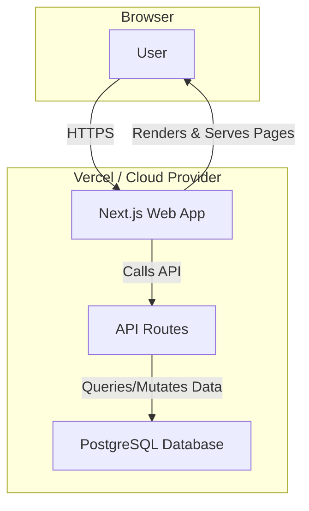
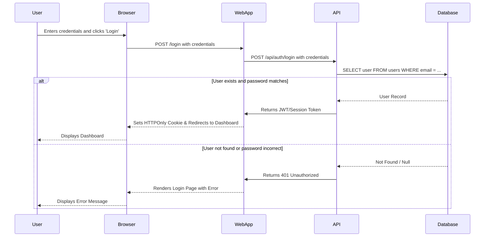

# Architecture Plan: [Project Name]

**Author:** [Your Name]
**Date:** 2025-01-01

Note: This is just an example. Fill out or simplify as needed.

---

## 1. Architectural Drivers & Decisions

This section covers the "why" behind the architecture, outlining the requirements, constraints, and major design choices.

### 1.1. Overview & Business Goals
A brief, high-level summary of the system's purpose and the goals it aims to achieve.
* *e.g., To create a simple website using Next.js and Tailwind CSS.*

### 1.2. Key Architectural Drivers
#### Constraints
*   **Technical:** Must use open-source technologies and integrate with a headless CMS or a local markdown system.
*   **Budgetary:** Monthly hosting costs must remain under $20.
*   **Time:** A minimum viable product (MVP) must be deployable within 3 months.

#### Non-Functional Requirements (NFRs)
The qualities the system must possess.
*   **Performance:** Average API response time must be <200ms. Page loads should be interactive in <2 seconds.
*   **Scalability:** The system should handle 100 concurrent users, with a clear path to scale to 1,000.
*   **Availability:** Target 99.9% uptime.
*   **Security:** Authentication must use modern, secure practices (e.g., OAuth2 or JWTs).

### 1.3. Core Architectural Decisions
*   **Architectural Pattern:** A monolithic approach using Next.js, where the frontend client and backend API service are part of the same application. This simplifies development and deployment for a personal project.
*   **Data Storage:** A combination of a PostgreSQL database for structured relational data (users, comments) and the local filesystem for markdown-based content (blog posts, project descriptions).
*   **Rationale:** This hybrid approach leverages a relational database for transactional integrity while using a simple, version-controlled file system for content.

---

# 2. Tools and Languages (Tech Stack)

A scannable list of the technologies used to build and run the project.

| Category      | Technology / Tool        | Rationale                                        |
|---------------|--------------------------|--------------------------------------------------|
| **Language** | `TypeScript`             | Provides type safety to reduce runtime errors.   |
| **Framework** | `React (Next.js)`        | SSR support, great developer experience, large ecosystem. |
| **Backend** | `Next.js (API Routes)`   | Provides serverless API endpoints colocated with the frontend. |
| **Database** | `PostgreSQL`             | Robust, reliable, and excellent for relational data. |
| **Styling** | `Tailwind CSS`           | Utility-first for rapid UI development.          |
| **Hosting** | `Vercel`                 | Simple deployment, generous free tier.           |
| **Other** | `Docker`                 | For consistent local development environments.   |

---

## 3. Architecture Diagram

A high-level view of the system's structure, showing the major components and their interactions.

*Diagram shows a user interacting with the Next.js application, which handles both web page rendering and API calls to the PostgreSQL database.*

---

## 4. System Workflow Example: User Login

This diagram illustrates the sequence of events for a critical user workflow.

*Workflow demonstrates the steps involved from the user submitting credentials to either successfully logging in or receiving an error message.*

---
## 5. Possible Improvements

Next steps to improve architecture documentation as projects grow:

*   **Adopt ADRs (Architecture Decision Records):** For more complex projects, create a dedicated `docs/adr/` directory. Each significant decision gets its own timestamped markdown file (e.g., `001-use-postgresql-database.md`). This creates an invaluable historical log of the project's evolution.
*   **Explore the C4 Model:** The diagram above is a simplified C4 "Container" diagram. The C4 model (Context, Containers, Components, Code) provides a framework for visualizing software at different levels of detail.
*   **Integrate Infrastructure as Code (IaC):** Consider defining your infrastructure using tools like Terraform. This makes your hosting setup repeatable, version-controlled, and documented by default.