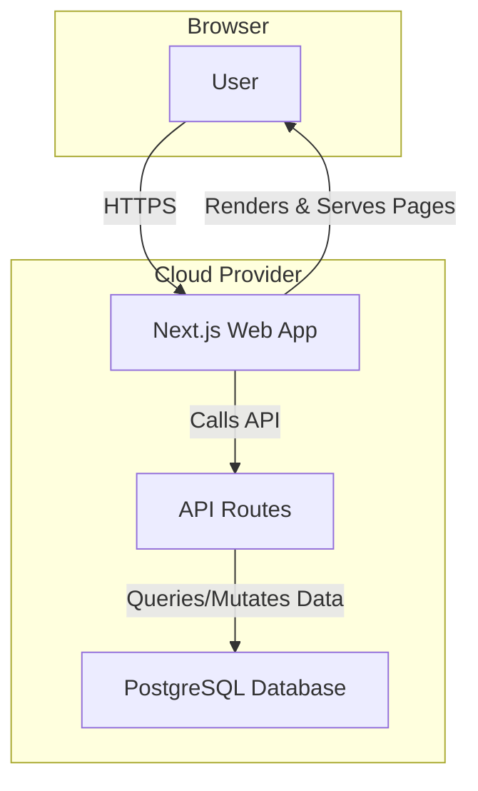
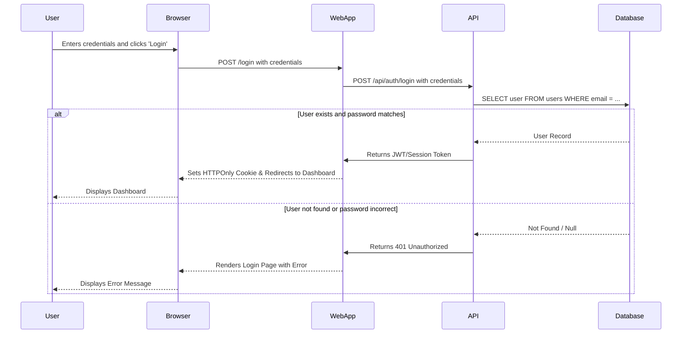

# System Architecture & Technical Specifications: [Project Name]

**Author:** [Your Name]
**Date:** 2025-01-01

---

## 1. Architectural Drivers & Decisions (The "Why")

This section covers the "why" behind the project, outlining the business goals, constraints, and major design choices that shape the system.

### 1.1. Overview & Business Goals
A brief, high-level summary of the system's purpose and the goals it aims to achieve.
* *e.g., To create a simple website using Next.js and Tailwind CSS.*

### 1.2. Key Architectural Drivers
#### Constraints
* **Technical:** Must use open-source technologies and integrate with a headless CMS or a local markdown system.
* **Budgetary:** Monthly hosting costs must remain under $20.
* **Time:** A minimum viable product (MVP) must be deployable within 3 months.

#### Non-Functional Requirements (NFRs)
The qualities the system must possess.
* **Performance:** Average API response time must be <200ms. Page loads should be interactive in <2 seconds.
* **Scalability:** The system should handle 100 concurrent users, with a clear path to scale to 1,000.
* **Availability:** Target 99.9% uptime.
* **Security:** Authentication must use modern, secure practices (e.g., OAuth2 or JWTs).

### 1.3. Core Architectural Decisions
* **Architectural Pattern:** A monolithic approach using Next.js, where the frontend client and backend API service are part of the same application. This simplifies development and deployment for a personal project.
* **Data Storage:** A combination of a PostgreSQL database for structured relational data (users, comments) and the local filesystem for markdown-based content (blog posts, project descriptions).
* **Rationale:** This hybrid approach leverages a relational database for transactional integrity while using a simple, version-controlled file system for content.

---

## 2. High-Level System Design (The "What")

This section provides a visual overview of the system's structure and key user workflows.

### 2.1. Architecture Diagram
A high-level view of the system's structure, showing the major components and their interactions.


*Diagram shows a user interacting with the Next.js application, which handles both web page rendering and API calls to the PostgreSQL database.*

### 2.2. System Workflow Example: User Login
This diagram illustrates the sequence of events for a critical user workflow.


*Workflow demonstrates the steps involved from the user submitting credentials to either successfully logging in or receiving an error message.*

---

## 3. Technology & Environment (The "With")

This section details the specific technologies used and how to set up a local development environment.

### 3.1. Development Environment Setup
A guide to setting up a local development environment.
* **Node.js:** `v20.x` or later
* **pnpm:** `pnpm` is the required package manager.
* **Docker & Docker Compose:** Required for running the database locally.
* **Git:** For version control.

### 3.2. Technology Stack
The specific libraries, frameworks, and tools used in this project.

| Category | Technology | Version | Rationale & Usage Notes |
| :--- | :--- | :--- | :--- |
| **Framework** | `Next.js` | `^14.1` | SSR support, App Router, Server Actions, API Routes. |
| **Language** | `TypeScript` | `^5.3` | Provides type safety to reduce runtime errors. Strict mode enabled. |
| **UI Library** | `React` | `^18.2` | Functional components with state management. |
| **Styling** | `Tailwind CSS` | `^3.4` | Utility-first for rapid UI development. |
| **Backend** | `Next.js (API Routes)` | `^14.1` | Provides serverless API endpoints colocated with the frontend. |
| **Database** | `PostgreSQL` | `^16.1` | Robust, reliable, and excellent for relational data. |
| **Hosting** | `Cloud Provider` | N/A | Any cloud provider of your choice. |
| **Linting** | `ESLint` | `^8.5` | Enforces code quality and style. |
| **Formatting** | `Prettier` | `^3.2` | Automatic code formatting. |
| **Containerization** | `Docker` | N/A | For consistent local development environments. |

---

## 4. Detailed Technical Implementation (The "How")

This section provides granular details on implementation patterns, conventions, and constraints for developers.

### 4.1. Key Implementation Decisions
Critical implementation-level decisions and their rationale.
* **API Design:** The project uses **Next.js API Routes** to implement a **RESTful API**. This keeps the frontend and backend in a single codebase, simplifying development.
* **Authentication:** Authentication is handled using **JWTs (JSON Web Tokens)** with an access token (short-lived, in memory) and a refresh token (long-lived, in a secure `HttpOnly` cookie). This provides a good balance of security and performance.
* **Data Fetching:** Client-side data fetching uses **React Query (`@tanstack/react-query`)** for robust caching, background refetching, and request deduplication.
* **State Management:** Global client-side state (e.g., UI theme) uses **Zustand** for its simplicity and minimal boilerplate.

### 4.2. Design Patterns & Coding Conventions
All code should adhere to the following patterns for consistency.
* **Folder Structure:** A **feature-based** folder structure is used within the `src/` directory.
    ```
    /src
    ├── /app
    ├── /components  # Shared, reusable UI components
    └── /features
        └── /auth    # Authentication feature
            ├── /components
            └── /api     # API route handlers
    ```
* **Component Design:** Components should be small and focused. Where appropriate, the **Container/Presentational Pattern** is encouraged to separate logic from UI.
* **Naming Conventions:**
    * Components: `PascalCase` (e.g., `UserProfile.tsx`)
    * Functions/Variables: `camelCase` (e.g., `getUserProfile`)
    * Types/Interfaces: `PascalCase` (e.g., `type UserProfile`)
* **Error Handling:**
    * **API:** Use centralized middleware for catching errors and formatting consistent responses.
    * **Client:** Use React's **Error Boundaries** to catch rendering errors and `try/catch` blocks in data-fetching functions.

### 4.3. Technical Constraints
Known limitations that developers must be aware of.
* **Database:** The project is developed against **PostgreSQL**. While Prisma allows for swapping databases, custom SQL queries are written in PostgreSQL syntax.
* **API Rate Limits:** Any third-party APIs used (e.g., GitHub) have rate limits. Code must handle potential `429 Too Many Requests` errors gracefully.
* **Browser Support:** Officially supports the **last two major versions of Chrome, Firefox, and Safari**. Functionality on other browsers is not guaranteed.
* **Performance Budget:** The initial JavaScript bundle size must not exceed **250kB (gzipped)**. Use `@next/bundle-analyzer` to monitor this.

---

## 5. Future Considerations

Next steps to improve documentation and architecture as the project grows.

* **Adopt ADRs (Architecture Decision Records):** For more complex projects, create a dedicated `docs/adr/` directory. Each significant decision gets its own timestamped markdown file (e.g., `001-use-postgresql-database.md`). This creates an invaluable historical log of the project's evolution.
* **Explore the C4 Model:** The diagram above is a simplified C4 "Container" diagram. The C4 model (Context, Containers, Components, Code) provides a framework for visualizing software at different levels of detail.
* **Integrate Infrastructure as Code (IaC):** Consider defining your infrastructure using tools like Terraform. This makes your hosting setup repeatable, version-controlled, and documented by default.